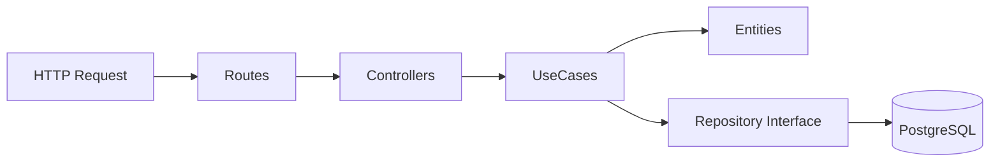

# BiblioCloud API - Gestión de Biblioteca Digital 📚

Este proyecto es una API REST robusta desarrollada en **Go**, diseñada siguiendo los principios de **Arquitectura Limpia Modular (Modular Clean Architecture)**. Ofrece una solución completa para la gestión de usuarios, materiales bibliográficos y flujos de préstamos en un entorno de biblioteca moderna.

## 🏗️ Resumen de la Arquitectura

La arquitectura está diseñada para ser escalable, testeable y fácil de mantener. Se organiza en módulos independientes que comparten una estructura de capas estandarizada.

### 🏛️ Estructura de Capas por Módulo

Cada módulo (`usuarios`, `recursos`, `prestamos`) está compuesto por:

1.  **Dominio (`domain`)**: Contiene el modelo de datos (**entities**) y las interfaces de almacenamiento (**repositories**). Es el núcleo del negocio y no depende de ninguna tecnología externa.
2.  **Aplicación (`application`)**: Define los casos de uso (**use cases**). Orquestra la lógica de negocio coordinando entre las entidades y los repositorios.
3.  **Infraestructura (`infrastructure`)**: Detalles de implementación técnica. Incluye:
    *   **Controllers/Handlers**: Manejo de peticiones HTTP con **Gin**.
    *   **Repository Postgres**: Implementación real de la persistencia de datos.
    *   **Routes**: Definición de endpoints y exposición del servicio.

---

## 📦 Módulos Principales

### 👤 Usuarios (`usuarios`)
Responsable de la gestión de identidad y estados de membresía.
- **Entidad**: `Usuario` (ID, Nombre, Email, Password, Estado, Cantidad de Préstamos).
- **Estados**: `ACTIVO`, `DEUDOR`.

### 📚 Recursos (`recursos`)
Gestiona el catálogo de materiales disponibles para préstamo.
- **Entidad**: `Recurso` (ID, Título, Categoría, ImagenURL, Descripción, Estado).
- **Estados**: `DISPONIBLE`, `PRESTADO`.

### 🤝 Préstamos (`prestamos`)
Controla las transacciones de salida y retorno de materiales.
- **Entidad**: `Prestamo` (ID, UsuarioID, RecursoID, Fechas de Inicio, Límite y Devolución, Estado).
- **Estados**: `ACTIVO`, `DEVUELTO`.

---

## 🛠️ Stack Tecnológico

- **Lenguaje**: Go 1.24+
- **Framework Web**: [Gin Gonic](https://github.com/gin-gonic/gin)
- **Base de Datos**: PostgreSQL (con driver `lib/pq`)
- **Variables de Entorno**: Managed via `.env` y `godotenv`
- **Arquitectura**: Clean Architecture con Inyección de Dependencias

## 📐 Flujo de Datos

---

## 🚀 Inicio Rápido

1.  Asegúrate de tener **Go 1.24+** instalado.
2.  Configura tu base de datos PostgreSQL y actualiza el archivo `.env`.
3.  Ejecuta con: `go run main.go`.
